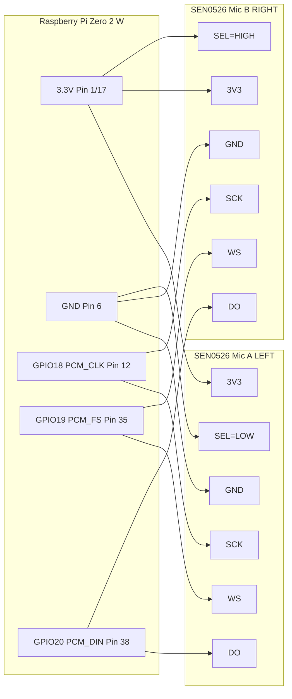

# Raspberry Pi Zero 2 W + 2× DFRobot SEN0526 (I2S MEMS) Stereo Capture

This repo is a small, practical starting point for wiring **two** DFRobot **SEN0526** I2S MEMS microphone breakouts to a **Raspberry Pi Zero 2 W** and recording **stereo (L/R)** audio using ALSA.

> Tested workflow target: `dtoverlay=googlevoicehat-soundcard` (fixed 48 kHz on many systems). If you need >48 kHz, you may need other overlays.

---

## Hardware

### Bill of Materials
- Raspberry Pi Zero 2 W (40-pin header)
- 2 × DFRobot SEN0526 (Fermion: I2S MEMS Microphone)
- (Recommended) 1 × 100 kΩ resistor (DO bus pull-down to GND)
- (Recommended) 2 × 0.1 µF capacitors (decoupling near each mic board)
- Jumper wires (keep I2S lines short)

### Pin Map (Stereo: one mic = Left, the other = Right)

All Raspberry Pi GPIO pins are **3.3V logic**. Do not feed 5V logic into GPIO.

| Signal | Raspberry Pi (BCM) | Pi physical pin | Mic A (Left) | Mic B (Right) |
|---|---:|---:|---|---|
| 3V3 | — | 1 (or 17) | 3V3 | 3V3 |
| GND | — | 6 (or any GND) | GND | GND |
| BCLK | GPIO18 (PCM_CLK) | 12 | SCK | SCK |
| LRCLK | GPIO19 (PCM_FS) | 35 | WS | WS |
| DATA IN | GPIO20 (PCM_DIN) | 38 | DO | DO |
| Channel select | — | — | SEL → GND | SEL → 3V3 |

**DO pull-down (recommended):** place **100 kΩ** from the shared **DO bus** to **GND**.

### Wiring diagram (Mermaid)




---

## Software Setup (Raspberry Pi OS)

### 1) Edit config.txt (Bookworm vs older)
- **Bookworm**: `/boot/firmware/config.txt`
- **Bullseye and earlier**: `/boot/config.txt`

Add:
```txt
dtoverlay=googlevoicehat-soundcard
```

Reboot.

### 2) Confirm ALSA device
```bash
arecord -l
```

If you see a new capture device, note its `card` and `device` numbers.

---

## Recording

### Quick record (5 seconds, stereo)
Edit `CARD`/`DEV` if needed.

```bash
CARD=0 DEV=0 ./scripts/record_stereo.sh 5
```

Output goes to `recordings/`.

### Check channel energy (sanity test)
Record yourself speaking **near Left mic only** then **near Right mic only**, then run:

```bash
python3 ./scripts/check_levels.py recordings/<yourfile>.wav
```

It prints per-channel RMS; you should see Left > Right when speaking near the left mic, and vice versa.

---

## systemd (optional)
If you want recording to start at boot, see `systemd/stereo-mic-capture.service`.

---

## Notes
- Many I2S MEMS mics output 24-bit samples in a 32-bit word. This repo records with `S32_LE` for robustness.
- Keep I2S wires short and share a solid ground; add local decoupling near each mic.

