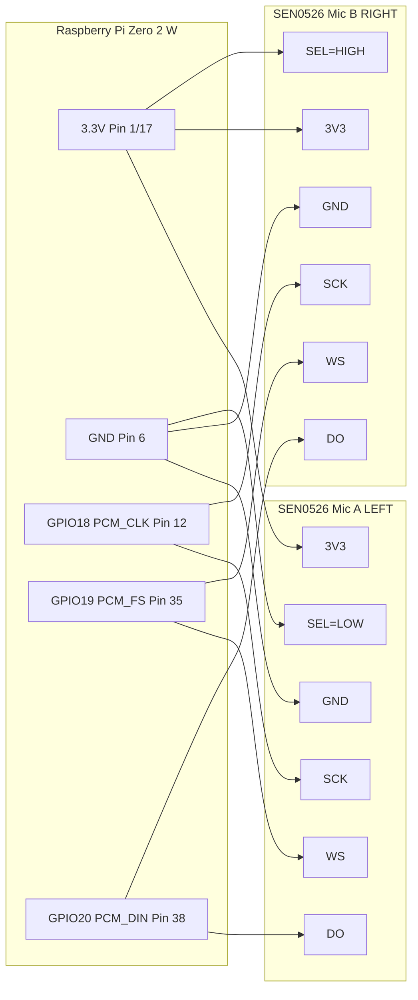

# Raspberry Pi Zero 2 W + 2× DFRobot SEN0526 (I2S MEMS) Stereo Capture
# Raspberry Pi Zero 2 W + 2× DFRobot SEN0526 (I2S MEMS) 立體聲錄音

> **English**: A complete guide for wiring **two** DFRobot **SEN0526** I2S MEMS microphones to a **Raspberry Pi Zero 2 W** and recording **stereo (L/R)** audio using ALSA.
>
> **中文**: 完整教學說明如何將 **兩顆** DFRobot **SEN0526** I2S MEMS 麥克風接到 **Raspberry Pi Zero 2 W** 並使用 ALSA 錄製 **立體聲（L/R）** 音訊。

**Tested with / 測試環境**: `dtoverlay=googlevoicehat-soundcard` (48 kHz)

---

## Table of Contents / 目錄

- [Hardware / 硬體](#hardware--硬體)
- [I2S Concept / I2S 觀念](#i2s-concept--i2s-觀念)
- [Wiring / 接線](#wiring--接線)
- [Software Setup / 軟體設定](#software-setup-raspberry-pi-os)
- [Recording / 錄音](#recording--錄音)
- [systemd Auto-start / 開機自動錄音](#systemd-auto-start--開機自動錄音)
- [Troubleshooting / 疑難排解](#troubleshooting--疑難排解)
- [Notes / 注意事項](#notes--注意事項)
- [References / 參考資料](#references--參考資料)
- [Live Streaming to iPhone / 即時串流到 iPhone](#live-streaming-to-iphone--即時串流到-iphone)
  - [Streaming Setup / 串流設定](#streaming-setup--串流設定)
  - [High-Quality Streaming (AAC 320kbps) / 高音質串流](#high-quality-streaming-aac-320kbps--高音質串流aac-320kbps)
  - [Usage / 使用方法](#usage--使用方法)
  - [Troubleshooting / 疑難排解](#troubleshooting--疑難排解-1)
  - [Auto-start on Boot / 開機自動啟動](#auto-start-on-boot--開機自動啟動)
  - [Performance Optimization / 效能優化](#performance-optimization--效能優化)
  - [Alternative Streaming Methods / 其他串流方法](#alternative-streaming-methods--其他串流方法)
- [License / 授權](#license--授權)
- [Contributing / 貢獻](#contributing--貢獻)
- [Power Supply Options / 電源選項](#power-supply-options--電源選項)

---

## Hardware / 硬體

### Bill of Materials / 材料清單
- **Raspberry Pi Zero 2 W** (40-pin header / 40針腳位)
  - Also compatible with / 也相容於: Zero W, Pi 3, Pi 4
- **2 × DFRobot SEN0526** (Fermion: I2S MEMS Microphone)
  - Chip: MSM261D4030H0
  - **購買連結 / Where to Buy**:
    - [台灣物聯科技 TaiwanIOT](https://www.taiwaniot.com.tw/product/fermion-i2s-mems-microphone-麥克風模組-dfrobot原廠/?srsltid=AfmBOop4D1TZo9lCu08oUPxjWM6VF2994H_Jx6oOAB1cqKPJXKlwu8VK)
    - [PlayRobot 機器人王國](https://shop.playrobot.com/products/csv0026?srsltid=AfmBOoqvqmqbnrmJ_eIc4jqgpgVz_t7LFSDRDN7dVMwTSK4j4G9IK5sC)
- **(Recommended / 建議)** 1 × **100 kΩ resistor** (DO bus pull-down to GND / DO 匯流排下拉至 GND)
- **(Recommended / 建議)** 2 × **0.1 µF capacitors** (decoupling near each mic board / 每個麥克風板附近的去耦電容)
- **Jumper wires** or breadboard / 杜邦線或麵包板
  - Keep I2S lines short (< 10 cm) / 保持 I2S 線路短 (< 10 cm)
- **(Optional / 選配)** **UPS Power Module** for portable/mobile use / 行動電源模組（用於行動/移動使用）
  - [樹莓派 Zero 專用 UPS 擴充模組（支援邊充邊放）](https://www.meiyagroup.com.tw/product/%E6%A8%B9%E8%8E%93%E6%B4%BE-zero-%E5%B0%88%E7%94%A8-ups-%E6%93%B4%E5%85%85%E6%A8%A1%E7%B5%84%E6%94%AF%E6%8F%B4%E9%82%8A%E5%85%85%E9%82%8A%E6%94%BE/?srsltid=AfmBOoqrzlQwoAVwR8lkNaXd743-JBGDeBgdyAEnAsltz4nGSIljBc3ZOnA) - 美雅群

---

## I2S Concept / I2S 觀念

### What is I2S? / 什麼是 I2S？

這個大叔的 YT 講得很清楚! 強烈推薦要看 https://youtu.be/m-MPBjScNRk?si=9fTCklse-UUwGKe3

**English:**

**I2S (Inter-IC Sound)** is a digital audio bus protocol designed for transmitting audio data between integrated circuits. It was developed by Philips (now NXP) in the 1980s and has become the standard for digital audio communication in embedded systems.

**Key Features / 主要特點:**
- **Digital audio transmission** - No analog conversion needed until final output / 數位音訊傳輸，無需類比轉換
- **Separate clock and data lines** - Reliable synchronization / 時脈與資料線分離，同步可靠
- **Stereo support** - Left and Right channels on single data line / 支援立體聲，單一資料線傳輸左右聲道
- **Simple 3-wire interface** - Easy to implement / 簡單的三線介面，易於實作

**中文：**

**I2S（Inter-IC Sound，晶片間音訊匯流排）** 是一種專為在積體電路之間傳輸音訊資料而設計的數位音訊匯流排協定。由飛利浦（現為 NXP）於 1980 年代開發，已成為嵌入式系統中數位音訊通訊的標準。

---

### I2S Signal Lines / I2S 訊號線

**English:**

I2S uses **3 main signal lines**:

| Signal | Name | Function | Description |
|--------|------|----------|-------------|
| **SCK** | Bit Clock (BCLK) | Timing | Clock for each bit of data / 每個資料位元的時脈 |
| **WS** | Word Select (LRCLK) | Channel | Left/Right channel selection / 左/右聲道選擇 |
| **SD** | Serial Data (DO/DI) | Data | Audio data stream / 音訊資料流 |

**Signal Timing / 訊號時序：**

```
BCLK  __|‾|_|‾|_|‾|_|‾|_|‾|_|‾|_|‾|_|‾|_    (Continuous clock / 連續時脈)
       
WS    ‾‾‾‾‾‾‾‾‾‾‾‾‾‾‾‾________‾‾‾‾‾‾‾‾    (Low=Left, High=Right / 低=左, 高=右)
       
SD    ═════════════════════════════════    (Data bits / 資料位元)
      ← Left Channel  →← Right Channel→
```

**中文：**

I2S 使用 **3 條主要訊號線**：

- **SCK (Bit Clock / 位元時脈)**：為每個資料位元提供時脈
- **WS (Word Select / 字選擇)**：指示當前是左聲道還是右聲道
  - WS = Low (0) → **Left channel** / 左聲道
  - WS = High (1) → **Right channel** / 右聲道
- **SD (Serial Data / 序列資料)**：實際的音訊資料流

---

### How I2S Stereo Works / I2S 立體聲如何運作

**English:**

I2S transmits stereo audio by **time-multiplexing** Left and Right channels on a single data line:

1. **WS goes LOW** → Transmit **Left** channel data / WS 變低 → 傳輸**左**聲道
2. **WS goes HIGH** → Transmit **Right** channel data / WS 變高 → 傳輸**右**聲道
3. Repeat for each sample / 每個樣本重複此過程

**Example at 48kHz sample rate / 48kHz 採樣率範例：**
- Sample rate: **48,000 samples/second** / 採樣率：每秒 48,000 個樣本
- Each sample: **24 bits** (stored in 32-bit word) / 每個樣本：24 位元（儲存於 32 位元字組）
- Bit clock (BCLK): 48,000 × 2 channels × 32 bits = **3.072 MHz** / 位元時脈

**中文：**

I2S 透過**時間多工**在單一資料線上傳輸左右聲道：

每個時脈週期，**WS (Word Select)** 訊號決定當前傳輸哪個聲道：
- 當 WS = 0（低位準）→ 傳輸**左聲道**資料
- 當 WS = 1（高位準）→ 傳輸**右聲道**資料

這樣的設計讓一條資料線就能傳輸完整的立體聲音訊。

---

### Tri-State and Shared Bus / 三態邏輯與共用匯流排

**English:**

**What is Tri-State? / 什麼是三態？**

Unlike normal digital logic (only HIGH/LOW), I2S devices can enter a **third state**: **High Impedance (Hi-Z)**.

**3 States / 三種狀態：**
1. **Logic HIGH (1)** - Actively driving the line high / 主動驅動訊號為高
2. **Logic LOW (0)** - Actively driving the line low / 主動驅動訊號為低
3. **High-Z (Tri-state)** - Disconnected, not driving the line / 斷開連接，不驅動訊號線

**Why This Matters for Stereo Microphones:**

When using **two I2S microphones** for stereo:
- Both mics share the same `BCLK` and `WS` lines / 共用時脈和字選擇線
- Both mics' `SD` outputs connect to **the same GPIO pin** / 資料輸出接到同一個 GPIO
- **SEL pin** determines which channel each mic responds to / SEL 腳位決定麥克風回應哪個聲道

**Operation / 運作方式：**

| Time | WS | Mic A (SEL=GND, Left) | Mic B (SEL=3V3, Right) |
|------|----|-----------------------|------------------------|
| T1 | **LOW** (Left) | **Outputs data** 輸出資料 | **Hi-Z** (silent) 高阻 |
| T2 | **HIGH** (Right) | **Hi-Z** (silent) 高阻 | **Outputs data** 輸出資料 |

Because only one mic outputs at a time, they can **safely share the same data line** without conflict!

**中文：**

**什麼是三態邏輯？**

與一般數位邏輯（只有高/低）不同，I2S 裝置可進入**第三種狀態**：**高阻抗（Hi-Z）**。

當不是麥克風該輸出的時間槽時，它會進入 **Hi-Z 狀態**，等同於「斷開連線」，不會干擾匯流排上的訊號。

**雙麥克風立體聲的運作原理：**

1. **左聲道麥克風**（SEL 接 GND）：
   - 當 WS = LOW（左聲道時間）→ **輸出資料**
   - 當 WS = HIGH（右聲道時間）→ **進入 Hi-Z**（高阻態，沉默）

2. **右聲道麥克風**（SEL 接 3V3）：
   - 當 WS = LOW（左聲道時間）→ **進入 Hi-Z**（高阻態，沉默）
   - 當 WS = HIGH（右聲道時間）→ **輸出資料**

因為同一時間**只有一個麥克風輸出**，所以可以安全地共用同一條資料線！

---

### Why Share One DO Bus? / 為什麼可以共用一條 DO 匯流排？

**English:**

**Summary / 總結：**
- Both microphones share the same `SCK (BCLK)` and `WS (LRCLK)` lines / 共用時脈線
- Both microphones' `DO (SD)` outputs can be **connected together** to Pi's `PCM_DIN (GPIO20)` / 資料線可併接
- When it's not the microphone's channel, it puts `DO` in **tri-state** (high impedance) / 非該聲道時進入三態
- The `SEL` pin determines whether it outputs on the Left or Right time slot / SEL 決定輸出時間槽

**Benefits / 優點：**
- ✅ **Saves GPIO pins** - Only need 3 GPIOs for stereo instead of 6 / 節省 GPIO 腳位
- ✅ **Synchronized** - Both mics use same clock, perfect timing / 完美同步
- ✅ **Standard I2S protocol** - No custom hardware needed / 標準協定，無需客製硬體
- ✅ **Simple wiring** - Easy to implement on breadboard / 接線簡單

**中文：**

**關鍵原理：**
- 兩顆麥克風共用 **同一組** `SCK(BCLK)` 與 `WS(LRCLK)`
- 兩顆麥克風的 `DO(SD)` **可以併在一起** 接到 Raspberry Pi 的 `PCM_DIN(GPIO20)`
- 麥克風在「不是自己那個聲道」時會讓 `DO` 進入 **tri-state**（高阻態）
- `SEL` 腳位決定它輸出在 Left 或 Right 時間槽

**實際效益：**
- ✅ 只需 3 個 GPIO（而非 6 個）就能實現立體聲錄音
- ✅ 兩個麥克風完美同步，不會有時間差
- ✅ 使用標準 I2S 協定，相容性高
- ✅ 接線簡單，適合麵包板快速測試

---

### Further Reading / 延伸閱讀

**I2S Protocol Specifications / I2S 協定規範：**
- [I2S Bus Specification (NXP Official)](https://www.nxp.com/docs/en/user-manual/UM10732.pdf) - Original I2S specification / 原始 I2S 規範
- [Understanding the I2S Interface (Texas Instruments)](https://www.ti.com/lit/an/slaa449/slaa449.pdf) - Detailed technical guide / 詳細技術指南
- [I2S Protocol Explained (SparkFun)](https://learn.sparkfun.com/tutorials/i2s-audio-breakout-hookup-guide/i2s-protocol) - Beginner-friendly tutorial / 初學者友善教學

**Tri-State Logic / 三態邏輯：**
- [Tri-State Logic Tutorial (Electronics Tutorials)](https://www.electronics-tutorials.ws/logic/logic_9.html) - Understanding Hi-Z state / 理解高阻態
- [What is Tri-State Buffer (All About Circuits)](https://www.allaboutcircuits.com/textbook/digital/chpt-3/tri-state-buffers/) - Tri-state buffer explained / 三態緩衝器說明

**I2S on Raspberry Pi / Raspberry Pi 上的 I2S：**
- [Raspberry Pi I2S Audio (Official Documentation)](https://www.raspberrypi.com/documentation/computers/raspberry-pi.html#i2s) - Pi I2S implementation / Pi I2S 實作
- [PCM/I2S Audio on Raspberry Pi](https://github.com/raspberrypi/linux/blob/rpi-6.1.y/Documentation/devicetree/bindings/sound/simple-card.yaml) - Device tree configuration / 裝置樹配置

**I2S MEMS Microphones / I2S MEMS 麥克風：**
- [MEMS Microphone Design Guide (Analog Devices)](https://www.analog.com/media/en/technical-documentation/app-notes/AN-1003.pdf) - MEMS mic technology / MEMS 麥克風技術
- [I2S MEMS Microphones Application Note (Infineon)](https://www.infineon.com/dgdl/Infineon-I2S_Interface-ApplicationNotes-v01_00-EN.pdf?fileId=5546d46250cc1fdf01513f30c4c0567f) - Implementation guide / 實作指南

---

## Wiring / 接線

---

## Wiring / 接線

### SEN0526 Pin Description / SEN0526 腳位說明

Module label / 模組標示: `GND 3V3 WS SEL SCK DO`

| Pin | Function | Description |
|---|---|---|
| **SCK** | I2S BCLK | Bit clock / 位元時脈 |
| **WS** | I2S LRCLK | Left/Right clock / 左右聲道時脈 |
| **DO** | I2S SD | Data output / 資料輸出 |
| **SEL** | Channel Select | Left (GND) or Right (3V3) / 左聲道（GND）或右聲道（3V3） |
| **3V3** | Power | 3.3V power supply / 3.3V 電源 |
| **GND** | Ground | Ground / 接地 |

### Raspberry Pi I2S/PCM Pins / Raspberry Pi I2S/PCM 腳位

| BCM GPIO | Physical Pin | Function | Description |
|---|---|---|---|
| **GPIO18** | **12** | PCM_CLK | I2S BCLK / 位元時脈 |
| **GPIO19** | **35** | PCM_FS | I2S LRCLK / 左右時脈 |
| **GPIO20** | **38** | **PCM_DIN** | **Data input (for mic) / 資料輸入（麥克風用）** |
| GPIO21 | 40 | PCM_DOUT | Data output (not used) / 資料輸出（不使用） |
| — | **1 or 17** | 3.3V | Power supply / 電源供應 |
| — | **6 or any GND** | GND | Ground / 接地 |

### Pin Map (Stereo: one mic = Left, the other = Right)
### 腳位對應（立體聲：一個麥克風 = 左聲道，另一個 = 右聲道）

⚠️ **All Raspberry Pi GPIO pins are 3.3V logic. Do not feed 5V logic into GPIO.**  
⚠️ **所有 Raspberry Pi GPIO 腳位都是 3.3V 邏輯。請勿將 5V 邏輯接入 GPIO。**

| Signal | Raspberry Pi (BCM) | Pi physical pin | Mic A (Left) | Mic B (Right) |
|---|---:|---:|---|---|
| **3V3** | — | **1** (or 17) | 3V3 | 3V3 |
| **GND** | — | **6** (or any GND) | GND | GND |
| **BCLK** | **GPIO18** (PCM_CLK) | **12** | SCK | SCK |
| **LRCLK** | **GPIO19** (PCM_FS) | **35** | WS | WS |
| **DATA IN** | **GPIO20** (PCM_DIN) | **38** | DO | DO |
| **Channel select** | — | — | **SEL → GND** | **SEL → 3V3** |

**Important Notes / 重要提醒：**
- ✅ Use `PCM_DIN (GPIO20)` for microphone input / 麥克風輸入使用 `PCM_DIN (GPIO20)`
- ❌ Do NOT use `PCM_DOUT (GPIO21)` / 請勿使用 `PCM_DOUT (GPIO21)`
- 🔌 Both microphones' `DO` connect to the same GPIO20 / 兩顆麥克風的 `DO` 都接到同一個 GPIO20

**DO pull-down (recommended) / DO 下拉（建議）:**  
Place **100 kΩ** resistor from the shared **DO bus** to **GND** to prevent floating when tri-state.  
在共用的 **DO 匯流排**與 **GND** 之間放置 **100 kΩ** 電阻以避免 tri-state 時浮動。

**Decoupling capacitors (optional) / 去耦電容（選配）:**  
Add **0.1 µF** ceramic capacitor between 3V3 and GND near each microphone to filter power noise.  
在每個麥克風的 3V3 和 GND 之間加 **0.1 µF** 陶瓷電容以濾除電源雜訊。

### Wiring Checklist / 接線檢查清單

Before powering on / 開機前檢查:
- [ ] 3V3 and GND connections are correct (check polarity) / 3V3 和 GND 接線正確（檢查極性）
- [ ] SCK, WS, DO connected to correct GPIOs / SCK、WS、DO 接到正確的 GPIO
- [ ] Left mic SEL → GND, Right mic SEL → 3V3 / 左麥克風 SEL → GND，右麥克風 SEL → 3V3
- [ ] DO bus has 100 kΩ pull-down to GND / DO 匯流排有 100 kΩ 下拉至 GND
- [ ] All connections are secure / 所有連接牢固
- [ ] No short circuits between 3V3 and GND / 3V3 和 GND 之間無短路

### Breadboard vs Soldering / 麵包板 vs 焊接

**Testing phase / 測試階段:**
- Use breadboard and jumper wires for easy adjustment / 使用麵包板和杜邦線方便調整
- Keep I2S signal wires short (< 10 cm) / 保持 I2S 訊號線短（< 10 cm）

**Permanent installation / 正式安裝:**
- Solder to perfboard or custom PCB / 焊接到洞洞板或自製 PCB
- Reduces contact issues and noise / 減少接觸不良和雜訊
- Use proper strain relief for wires / 對線材使用適當的應力消除

### Wiring diagram / 接線圖 (Mermaid)




---

## Software Setup (Raspberry Pi OS)
## 軟體設定（Raspberry Pi OS）

### 0) Install OS / 安裝作業系統

**Using Raspberry Pi Imager / 使用 Raspberry Pi Imager:**

1. Download and install [Raspberry Pi Imager](https://www.raspberrypi.com/software/)
2. Select **Raspberry Pi OS Lite** (64-bit recommended for Zero 2 W)
3. Click the gear icon ⚙️ for advanced settings / 點擊齒輪圖示⚙️進行進階設定

**Configure settings / 設定選項:**
- ✅ **Enable SSH** / 啟用 SSH
  - Use password authentication / 使用密碼驗證
- ✅ **Set username and password** / 設定使用者名稱和密碼
  - Username: `pi` (or your choice / 或自選)
  - Password: (choose a secure password / 選擇安全密碼)
- ✅ **Configure Wi-Fi** (for Zero 2 W) / 設定 Wi-Fi（用於 Zero 2 W）
  - SSID: your network name / 您的網路名稱
  - Password: your Wi-Fi password / 您的 Wi-Fi 密碼
  - Country: select your country / 選擇您的國家
- ✅ **Set locale settings** / 設定語系
  - Timezone: your timezone / 您的時區
  - Keyboard layout: your layout / 您的鍵盤配置

4. Write to SD card / 寫入 SD 卡
5. Insert SD card into Pi and power on / 將 SD 卡插入 Pi 並開機

**First login / 首次登入:**
```bash
# Wait ~30-60 seconds for boot, then connect via SSH
# 等待約 30-60 秒開機，然後透過 SSH 連線
ssh pi@raspberrypi.local
# or use IP address / 或使用 IP 位址
ssh pi@<your-pi-ip>
```

### 1) Update system & install packages / 更新系統並安裝套件

```bash
# Update package lists / 更新套件列表
sudo apt update

# Upgrade all packages / 升級所有套件
sudo apt full-upgrade -y

# Install required packages / 安裝必要套件
sudo apt install -y alsa-utils sox git python3
```

**Package descriptions / 套件說明:**
- `alsa-utils` - ALSA audio tools (includes `arecord`) / ALSA 音訊工具（包含 `arecord`）
- `sox` - Audio processing tool (for splitting stereo) / 音訊處理工具（用於分離立體聲）
- `git` - Version control (for cloning this repo) / 版本控制（用於下載本專案）
- `python3` - Python 3 (for level checking script) / Python 3（用於音量檢查腳本）

### 2) Edit config.txt / 編輯 config.txt

**Find config.txt location / 找到 config.txt 位置：**

```bash
# Check which file exists / 檢查哪個檔案存在
ls -l /boot/config.txt /boot/firmware/config.txt 2>/dev/null
```

**Location depends on OS version / 位置取決於作業系統版本:**
- **Bookworm (new / 新版)**: `/boot/firmware/config.txt`
- **Bullseye and earlier / Bullseye 及更早**: `/boot/config.txt`

**Edit the file / 編輯檔案：**

For Bookworm / 適用於 Bookworm:
```bash
sudo nano /boot/firmware/config.txt
```

For Bullseye or earlier / 適用於 Bullseye 或更早:
```bash
sudo nano /boot/config.txt
```

**Add these lines at the end / 在檔案末尾加入：**

```ini
# ===== I2S MEMS Microphone Configuration =====
# Disable onboard audio (conflicts with I2S)
# 停用板載音訊（與 I2S 衝突）
dtparam=audio=off

# Enable I2S interface
# 啟用 I2S 介面
dtparam=i2s=on

# Load Google Voice HAT sound card driver
# 載入 Google Voice HAT 音效卡驅動
# This provides 48kHz stereo capture
# 提供 48kHz 立體聲錄音
dtoverlay=googlevoicehat-soundcard
```

**Save and exit / 儲存並退出:**
- Press `Ctrl+O` then `Enter` to save / 按 `Ctrl+O` 然後 `Enter` 儲存
- Press `Ctrl+X` to exit / 按 `Ctrl+X` 退出

**Why googlevoicehat-soundcard? / 為什麼選擇 googlevoicehat-soundcard？**
- ✅ Built-in to Raspberry Pi OS (no compilation needed) / Raspberry Pi OS 內建（無需編譯）
- ✅ Stable and well-tested / 穩定且經過充分測試
- ✅ Automatic 48kHz / 16-bit stereo configuration / 自動設定 48kHz / 16 位元立體聲
- ✅ Suitable for most I2S MEMS microphones / 適用於大多數 I2S MEMS 麥克風
- ⚠️ Fixed at 48kHz (cannot change sample rate) / 固定在 48kHz（無法更改採樣率）

### 3) Reboot / 重新啟動

```bash
sudo reboot
```

Wait ~30 seconds, then reconnect via SSH.  
等待約 30 秒，然後重新透過 SSH 連線。

### 4) Confirm ALSA device / 確認 ALSA 設備

**Check sound cards / 檢查音效卡：**
```bash
cat /proc/asound/cards
```

**Expected output / 預期輸出:**
```
 0 [vc4hdmi       ]: vc4-hdmi - vc4-hdmi
                      vc4-hdmi
 1 [googlevoicehat]: googlevoicehat-soundcar - googlevoicehat-soundcar
                      googlevoicehat-soundcard
```

**List capture devices / 列出錄音裝置：**
```bash
arecord -l
```

**Expected output / 預期輸出:**
```
**** List of CAPTURE Hardware Devices ****
card 1: googlevoicehat [googlevoicehat-soundcard], device 0: Google voiceHAT SoundCard HiFi voicehat-hifi-0 [...]
  Subdevices: 1/1
  Subdevice #0: subdevice #0
```

Note the `card` number (usually **1**) and `device` number (usually **0**).  
記下 `card` 編號（通常是 **1**）和 `device` 編號（通常是 **0**）。

**Check supported parameters / 檢查支援的參數：**
```bash
arecord -D hw:1,0 --dump-hw-params -d 1 /dev/null
```

This shows supported sample rates, formats, and channels.  
這會顯示支援的採樣率、格式和聲道數。

---

## Recording / 錄音

### Method 1: Quick record using scripts / 方法 1：使用腳本快速錄音

**Clone this repository / 下載本專案：**
```bash
cd ~
git clone https://github.com/cychiang-ntpu/audio-streaming-from-laptop-to-iphone.git
cd audio-streaming-from-laptop-to-iphone
chmod +x scripts/*.sh
```

**Check environment / 檢查環境：**
```bash
./scripts/check_env.sh
```

**Record 5 seconds of stereo audio / 錄製 5 秒立體聲：**
```bash
CARD=1 DEV=0 ./scripts/record_stereo.sh 5
```

Output goes to `recordings/` directory with timestamp.  
輸出到 `recordings/` 目錄，檔名含時間戳記。

**Check channel levels / 檢查聲道音量：**
```bash
python3 ./scripts/check_levels.py recordings/stereo_*.wav
```

### Method 2: Manual recording / 方法 2：手動錄音

**Record 5 seconds / 錄製 5 秒：**
```bash
arecord -D hw:1,0 -c 2 -r 48000 -f S32_LE -d 5 test_stereo.wav
```

**Parameters explained / 參數說明：**
- `-D hw:1,0`: Device (card 1, device 0) / 設備（卡 1，設備 0）
- `-c 2`: Stereo (2 channels) / 立體聲（2 聲道）
- `-r 48000`: Sample rate 48kHz / 採樣率 48kHz
- `-f S32_LE`: 32-bit PCM (for I2S MEMS) / 32 位元 PCM（用於 I2S MEMS）
- `-d 5`: Duration 5 seconds / 時長 5 秒

**Split into left and right channels / 分離左右聲道：**
```bash
sox test_stereo.wav left.wav remix 1
sox test_stereo.wav right.wav remix 2
```

### Sanity test / 健全性測試

Record yourself speaking **near Left mic only**, then **near Right mic only**.  
先只對著**左麥克風**說話錄音，再只對著**右麥克風**說話錄音。

Run the level check / 執行音量檢查:
```bash
python3 ./scripts/check_levels.py test_stereo.wav
```

You should see Left > Right when speaking near left mic, and vice versa.  
對著左麥克風說話時應該看到 Left > Right，反之亦然。

---

## systemd Auto-start / 開機自動錄音

If you want recording to start automatically at boot / 如果想要開機時自動開始錄音:

**1) Copy service file / 複製服務檔案：**
```bash
sudo cp systemd/stereo-mic-capture.service /etc/systemd/system/
```

**2) Edit the service file to match your setup / 編輯服務檔案以符合您的設定：**
```bash
sudo nano /etc/systemd/system/stereo-mic-capture.service
```

Update `WorkingDirectory` to your repo location.  
更新 `WorkingDirectory` 為您的專案位置。

**3) Enable and start the service / 啟用並啟動服務：**
```bash
sudo systemctl enable stereo-mic-capture.service
sudo systemctl start stereo-mic-capture.service
```

**4) Check status / 檢查狀態：**
```bash
sudo systemctl status stereo-mic-capture.service
```

**5) View logs / 查看記錄：**
```bash
sudo journalctl -u stereo-mic-capture.service -f
```

---

## Troubleshooting / 疑難排解

### Problem: No sound card detected / 問題：偵測不到音效卡

**Check I2S is enabled / 檢查 I2S 是否啟用：**
```bash
sudo raspi-config
# Select: Interface Options > I2S > Enable
```

**Verify config.txt / 驗證 config.txt：**
```bash
cat /boot/firmware/config.txt | grep -E "i2s|googlevoicehat"
```

### Problem: Recording is silent or noisy / 問題：錄音無聲或有雜訊

**Check wiring / 檢查接線：**
- ✅ DO pins connected to GPIO20 (not GPIO21) / DO 腳位接到 GPIO20（不是 GPIO21）
- ✅ SEL: one mic to GND, other to 3V3 / SEL：一個麥克風接 GND，另一個接 3V3
- ✅ 100 kΩ pull-down resistor on DO bus / DO 匯流排上有 100 kΩ 下拉電阻
- ✅ All connections are secure / 所有連接牢固

**Test hardware / 測試硬體：**
```bash
arecord -D hw:1,0 --dump-hw-params -d 1 /dev/null
```

### Problem: Sample rate error / 問題：採樣率錯誤

`googlevoicehat-soundcard` is **fixed at 48kHz**. Cannot be changed.  
`googlevoicehat-soundcard` **固定在 48kHz**。無法更改。

If you need other sample rates, use different overlays like `hifiberry-dac`.  
如果需要其他採樣率，請使用其他驅動如 `hifiberry-dac`。

### Problem: Wrong channel assignment / 問題：聲道分配錯誤

If left and right are swapped / 如果左右聲道相反:
- Swap the SEL connections on the two microphones / 交換兩個麥克風的 SEL 連接
- Or swap them in post-processing with sox / 或用 sox 在後製時交換

---

## Notes / 注意事項

**About I2S MEMS microphones / 關於 I2S MEMS 麥克風：**
- Many I2S MEMS mics output **24-bit samples in 32-bit words**.  
  許多 I2S MEMS 麥克風以 **32 位元字組輸出 24 位元樣本**。
- This repo uses `S32_LE` format for robustness.  
  本專案使用 `S32_LE` 格式以確保穩定性。
- Actual dynamic range is ~94 dB (24-bit).  
  實際動態範圍約 94 dB（24 位元）。

**Best practices / 最佳實踐：**
- 🔌 Keep I2S wires **short** (< 10 cm) / 保持 I2S 線路**短** (< 10 cm)
- ⚡ Use a **solid ground** connection / 使用**可靠的接地**連接
- 🔋 Add **0.1 µF decoupling capacitors** near each mic / 在每個麥克風附近添加 **0.1 µF 去耦電容**
- 📍 For permanent installation, **solder** connections instead of breadboard / 正式安裝時，**焊接**連接而非使用麵包板

---

## References / 參考資料

### I2S Protocol & Theory / I2S 協定與原理
- [I2S Bus Specification (NXP Official PDF)](https://www.nxp.com/docs/en/user-manual/UM10732.pdf) - Original specification from Philips/NXP / 飛利浦/NXP 原始規範
- [Understanding the I2S Interface (Texas Instruments)](https://www.ti.com/lit/an/slaa449/slaa449.pdf) - Technical application note / 技術應用手冊
- [I2S Protocol Explained (SparkFun Tutorial)](https://learn.sparkfun.com/tutorials/i2s-audio-breakout-hookup-guide/i2s-protocol) - Beginner-friendly guide / 初學者友善指南
- [Tri-State Logic (Electronics Tutorials)](https://www.electronics-tutorials.ws/logic/logic_9.html) - Understanding high-impedance state / 理解高阻態

### Raspberry Pi I2S Implementation / Raspberry Pi I2S 實作
- [Raspberry Pi I2S Documentation (Official)](https://www.raspberrypi.com/documentation/computers/raspberry-pi.html#i2s) - Official Pi I2S docs / 官方 Pi I2S 文件
- [Setting up I2S Soundcard on Raspberry Pi](https://protonestiot.medium.com/setting-up-i2s-soundcard-on-raspberry-pi-inmp441-microphone-f0c8fc859b2e) - INMP441 setup guide / INMP441 設定指南

### I2S MEMS Microphones / I2S MEMS 麥克風
- [Adafruit I2S MEMS Microphone Breakout](https://learn.adafruit.com/adafruit-i2s-mems-microphone-breakout/overview) - General I2S mic tutorial / 通用 I2S 麥克風教學
- [DFRobot SEN0526 Product Page](https://www.dfrobot.com/product-2357.html) - Official product specs / 官方產品規格
- [MEMS Microphone Design Guide (Analog Devices)](https://www.analog.com/media/en/technical-documentation/app-notes/AN-1003.pdf) - MEMS technology overview / MEMS 技術概述

**購買 DFRobot SEN0526 (台灣) / Where to Buy in Taiwan:**
- [台灣物聯科技 TaiwanIOT](https://www.taiwaniot.com.tw/product/fermion-i2s-mems-microphone-麥克風模組-dfrobot原廠/?srsltid=AfmBOop4D1TZo9lCu08oUPxjWM6VF2994H_Jx6oOAB1cqKPJXKlwu8VK)
- [PlayRobot 機器人王國](https://shop.playrobot.com/products/csv0026?srsltid=AfmBOoqvqmqbnrmJ_eIc4jqgpgVz_t7LFSDRDN7dVMwTSK4j4G9IK5sC)

### External Documentation / 外部文件
- [ALSA Project Documentation](https://www.alsa-project.org/wiki/Documentation) - Linux audio system / Linux 音訊系統
- [FFmpeg Documentation](https://ffmpeg.org/documentation.html) - Audio streaming reference / 音訊串流參考
- [MediaMTX Documentation](https://github.com/bluenviron/mediamtx) - RTSP server guide / RTSP 伺服器指南

### Scripts / 腳本
- [check_env.sh](scripts/check_env.sh) - Environment checker / 環境檢查器
- [record_stereo.sh](scripts/record_stereo.sh) - Stereo recording script / 立體聲錄音腳本
- [check_levels.py](scripts/check_levels.py) - Channel level analyzer / 聲道音量分析器
- [systemd service](systemd/stereo-mic-capture.service) - Auto-start service / 開機自動啟動服務

---

---

## Live Streaming to iPhone / 即時串流到 iPhone

### Overview / 概述

**English:**
After recording stereo audio with I2S MEMS microphones, you can stream it in real-time to your iPhone over WiFi hotspot using MediaMTX and FFmpeg. This section provides a complete guide for setting up high-quality AAC streaming at 320 kbps.

**中文：**
完成 I2S MEMS 麥克風的立體聲錄音設定後，您可以透過 iPhone 熱點使用 MediaMTX 和 FFmpeg 將音訊即時串流到手機。本章節提供完整的 AAC 320 kbps 高音質串流設定教學。

### Use Cases / 適用場景

- 🎤 **Wireless Microphone / 無線麥克風**: Pi + I2S Mics → iPhone amplification / Pi + I2S 麥克風 → iPhone 擴音
- 👂 **Remote Monitoring / 遠端監聽**: Real-time audio monitoring over local network / 區域網路內即時音訊監控
- 📡 **Audio Broadcasting / 音訊轉播**: Stream Pi audio to mobile devices / 將 Pi 音訊串流到行動裝置
- ⚡ **Low Latency Testing / 低延遲測試**: Test different protocols for latency performance / 測試不同協定的延遲表現

### Streaming Options / 串流方案比較

| Protocol / 協定 | Latency / 延遲 | Quality / 音質 | Bandwidth / 頻寬 | Complexity / 複雜度 | Best For / 最適合 |
|------|------|------|------|--------|----------|
| **RTSP (AAC)** | 30-100ms | Good / 良好 | 24-320 kbps | Medium / 中 | Real-time listening / 即時監聽 |
| **HTTP-WAV** | 200-500ms | Lossless / 無損 | 1.5 Mbps | Low / 低 | Quality priority / 音質優先 |
| **Icecast (MP3)** | 500-1000ms | Good / 良好 | 128 kbps | Low / 低 | Background playback / 背景播放 |

---

## Streaming Setup / 串流設定

### Prerequisites / 前置需求

**Hardware / 硬體：**
- ✅ Raspberry Pi with I2S microphones configured (see above sections) / 已設定 I2S 麥克風的 Raspberry Pi（參見前面章節）
- ✅ iPhone with personal hotspot enabled / 開啟個人熱點的 iPhone
- ✅ Adequate power supply (2.5A+) / 充足的電源供應（2.5A+）

**Software / 軟體：**
- ✅ Raspberry Pi OS (Bookworm or Bullseye) / Raspberry Pi 作業系統
- ✅ FFmpeg / FFmpeg 工具
- ✅ MediaMTX (for RTSP streaming) / MediaMTX（用於 RTSP 串流）
- ✅ VLC player on iPhone / iPhone 上的 VLC 播放器

### Step 1: Install Dependencies / 安裝依賴套件

```bash
# Update system / 更新系統
sudo apt-get update

# Install FFmpeg and ALSA tools / 安裝 FFmpeg 和 ALSA 工具
sudo apt-get install -y ffmpeg alsa-utils wget tar

# Install Git (for cloning scripts) / 安裝 Git（用於下載腳本）
sudo apt-get install -y git
```

### Step 2: Download MediaMTX / 下載 MediaMTX

**MediaMTX** is a lightweight RTSP/RTMP/HLS server optimized for low latency.  
**MediaMTX** 是一個輕量級 RTSP/RTMP/HLS 伺服器，針對低延遲優化。

```bash
# Navigate to home directory / 進入主目錄
cd ~

# For Raspberry Pi Zero 2 W (64-bit) / 適用於 Raspberry Pi Zero 2 W（64位元）
wget https://github.com/bluenviron/mediamtx/releases/latest/download/mediamtx_linux_arm64v8.tar.gz
tar -xzf mediamtx_linux_arm64v8.tar.gz

# For 32-bit Raspberry Pi OS / 適用於 32位元 Raspberry Pi OS
# wget https://github.com/bluenviron/mediamtx/releases/latest/download/mediamtx_linux_armv7.tar.gz
# tar -xzf mediamtx_linux_armv7.tar.gz

# Make executable / 設定為可執行
chmod +x mediamtx

# Verify installation / 驗證安裝
./mediamtx --version
```

### Step 3: Configure MediaMTX / 配置 MediaMTX

Create a minimal configuration file / 建立最小配置檔案：

```bash
# Create mediamtx.yml / 建立 mediamtx.yml 檔案
cat > ~/mediamtx.yml << 'EOF'
# MediaMTX Configuration for Stereo Audio Streaming
# MediaMTX 立體聲音訊串流配置

rtspAddress: :8554
readTimeout: 1s
writeTimeout: 1s
readBufferCount: 16

paths:
  mic:
    source: publisher
EOF
```

**Configuration explained / 配置說明：**
- `rtspAddress: :8554` - RTSP server listens on port 8554 / RTSP 伺服器監聽 8554 埠
- `readTimeout/writeTimeout` - Network timeout settings / 網路逾時設定
- `paths.mic` - Stream path name (will be rtsp://IP:8554/mic) / 串流路徑名稱

### Step 4: Clone Streaming Scripts / 下載串流腳本

```bash
# Clone this repository / 下載本專案
cd ~
git clone https://github.com/cychiang-ntpu/audio-streaming-from-laptop-to-iphone.git
cd audio-streaming-from-laptop-to-iphone

# Copy scripts from streaming / 從 streaming 複製腳本
cp streaming/mediamtx_start.sh .
cp streaming/rtsp_ffmpeg_push_autodetect.sh .

# Make scripts executable / 賦予執行權限
chmod +x mediamtx_start.sh rtsp_ffmpeg_push_autodetect.sh
chmod +x streaming/set_firewall_rules.sh
```

### Step 5: Configure Firewall (Optional) / 配置防火牆（選用）

```bash
# Run firewall configuration script / 執行防火牆配置腳本
cd ~/audio-streaming-from-laptop-to-iphone
./streaming/set_firewall_rules.sh

# Enable firewall if needed / 如需啟用防火牆
# sudo ufw enable
```

The script opens these ports / 腳本會開放以下埠：
- **8554/tcp** - RTSP streaming / RTSP 串流
- **8080/tcp** - HTTP-WAV streaming / HTTP-WAV 串流
- **8000/tcp** - Icecast streaming / Icecast 串流
- **22/tcp** - SSH access / SSH 存取

---

## High-Quality Streaming (AAC 320kbps) / 高音質串流（AAC 320kbps）

### Create High-Quality Streaming Script / 建立高音質串流腳本

Create a new script for 320kbps stereo streaming / 建立新腳本用於 320kbps 立體聲串流：

```bash
# Create the script / 建立腳本
cat > ~/audio-streaming-from-laptop-to-iphone/rtsp_ffmpeg_push_hq_stereo.sh << 'EOF'
#!/bin/bash
# High-Quality Stereo AAC Streaming (320kbps)
# 高音質立體聲 AAC 串流（320kbps）

# Auto-detect I2S microphone / 自動偵測 I2S 麥克風
MIC_NAME=$(arecord -l | grep -E "googlevoicehat|I2S" | grep -oP 'card \K\d+' | head -1)
if [ -z "$MIC_NAME" ]; then
    echo "[ERROR] No I2S microphone found. Check 'arecord -l'"
    echo "[錯誤] 找不到 I2S 麥克風。請檢查 'arecord -l'"
    exit 1
fi
MIC_DEV="hw:$MIC_NAME,0"

RTSP_URL="rtsp://127.0.0.1:8554/mic"

echo "================================================"
echo "High-Quality Stereo Audio Streaming"
echo "高音質立體聲音訊串流"
echo "================================================"
echo "Device / 裝置: $MIC_DEV"
echo "Sample Rate / 採樣率: 48000 Hz"
echo "Channels / 聲道: 2 (Stereo / 立體聲)"
echo "Codec / 編碼: AAC"
echo "Bitrate / 位元率: 320 kbps"
echo "RTSP URL: $RTSP_URL"
echo "================================================"
echo ""
echo "Press Ctrl+C to stop / 按 Ctrl+C 停止"
echo ""

# Start streaming / 開始串流
ffmpeg -f alsa -i "$MIC_DEV" \
 -ar 48000 -ac 2 \
 -c:a aac -b:a 320k \
 -flags +global_header \
 -fflags nobuffer+flush_packets \
 -max_delay 0 \
 -probesize 32 \
 -analyzeduration 0 \
 -strict experimental \
 -f rtsp -rtsp_transport tcp \
 "$RTSP_URL"
EOF

# Make executable / 設定為可執行
chmod +x ~/audio-streaming-from-laptop-to-iphone/rtsp_ffmpeg_push_hq_stereo.sh
```

**Script parameters explained / 腳本參數說明：**

| Parameter / 參數 | Value / 值 | Description / 說明 |
|---|---|---|
| `-ar 48000` | 48 kHz | Sample rate (matches I2S config) / 採樣率（符合 I2S 設定） |
| `-ac 2` | Stereo | 2 channels (Left/Right) / 2 聲道（左/右） |
| `-c:a aac` | AAC | Audio codec / 音訊編碼 |
| `-b:a 320k` | 320 kbps | High bitrate for quality / 高位元率以確保音質 |
| `-flags +global_header` | - | Required for RTSP / RTSP 必需 |
| `-fflags nobuffer` | - | Minimize buffering / 最小化緩衝 |
| `-max_delay 0` | - | Reduce delay / 減少延遲 |
| `-rtsp_transport tcp` | TCP | Reliable transport / 可靠的傳輸 |

---

## Usage / 使用方法

### Method 1: High-Quality Stereo Streaming (Recommended) / 方法 1：高音質立體聲串流（推薦）

**Step 1: Connect to iPhone Hotspot / 連接 iPhone 熱點**

```bash
# Configure WiFi / 配置 WiFi
sudo raspi-config
# Select: System Options → Wireless LAN
# Enter iPhone hotspot SSID and password / 輸入 iPhone 熱點名稱和密碼

# Enable "Maximum Compatibility" on iPhone / 在 iPhone 開啟「最大相容性」模式
# Settings → Personal Hotspot → Maximize Compatibility / 設定 → 個人熱點 → 最大化相容性

# Reboot to apply / 重開機以套用
sudo reboot
```

**Step 2: Check IP Address / 檢查 IP 位址**

After reboot, SSH back in and check IP / 重新啟動後，重新 SSH 連線並檢查 IP：

```bash
# Get Pi IP address (usually 172.20.10.x) / 取得 Pi IP 位址（通常是 172.20.10.x）
hostname -I

# Or more detailed / 或更詳細：
ip addr show wlan0 | grep "inet " | awk '{print $2}' | cut -d/ -f1
```

**Step 3: Start MediaMTX Server / 啟動 MediaMTX 伺服器**

```bash
cd ~/audio-streaming-from-laptop-to-iphone

# Start MediaMTX / 啟動 MediaMTX
./mediamtx_start.sh
```

Leave this terminal running / 保持此終端機執行。

**Expected output / 預期輸出：**
```
2025/12/23 10:30:00 INF MediaMTX v1.x.x
2025/12/23 10:30:00 INF [RTSP] listener opened on :8554
2025/12/23 10:30:00 INF [path mic] waiting for publisher
```

**Step 4: Start Streaming (New Terminal) / 啟動串流（新終端機）**

Open a new SSH session or use `tmux`/`screen` / 開啟新的 SSH 連線或使用 `tmux`/`screen`：

```bash
cd ~/audio-streaming-from-laptop-to-iphone

# Start high-quality streaming / 啟動高音質串流
./rtsp_ffmpeg_push_hq_stereo.sh
```

**Expected output / 預期輸出：**
```
================================================
High-Quality Stereo Audio Streaming
高音質立體聲音訊串流
================================================
Device / 裝置: hw:1,0
Sample Rate / 採樣率: 48000 Hz
Channels / 聲道: 2 (Stereo / 立體聲)
Codec / 編碼: AAC
Bitrate / 位元率: 320 kbps
RTSP URL: rtsp://127.0.0.1:8554/mic
================================================

Press Ctrl+C to stop / 按 Ctrl+C 停止

[ffmpeg output...]
```

**Step 5: Play on iPhone / 在 iPhone 上播放**

1. **Install VLC / 安裝 VLC**
   - Download VLC from App Store / 從 App Store 下載 VLC
   
2. **Configure VLC for Low Latency / 配置 VLC 低延遲設定**
   - ⚠️ **Critical for low latency! / 低延遲必須設定！**
   - Open VLC → Settings (⚙️) / 開啟 VLC → 設定（⚙️）
   - Tap "Show All Settings" / 點選「顯示所有設定」
   - Navigate to: Input / Codecs → Network Caching / 導航至：輸入/編解碼器 → 網路快取
   - Set to **0 ms** or **50 ms** (for lowest latency) / 設為 **0 ms** 或 **50 ms**（最低延遲）
   - Restart VLC / 重新啟動 VLC

3. **Connect to Stream / 連接串流**
   - In VLC, tap "Network" tab / 在 VLC 中，點選「網路」分頁
   - Enter URL / 輸入網址：
   ```
   rtsp://<Pi_IP_Address>:8554/mic
   ```
   - Example / 範例：`rtsp://172.20.10.100:8554/mic`
   - Tap "Play" / 點選「播放」

4. **Verify Stereo / 驗證立體聲**
   - Speak into Left microphone → should hear in Left ear / 對著左麥克風說話 → 應該從左耳聽到
   - Speak into Right microphone → should hear in Right ear / 對著右麥克風說話 → 應該從右耳聽到

---

### Method 2: Quick Test with Auto-detect / 方法 2：快速測試（自動偵測）

For testing purposes, use the auto-detect script (lower quality) / 測試用途可使用自動偵測腳本（較低音質）：

```bash
# Start MediaMTX / 啟動 MediaMTX
./mediamtx_start.sh

# In another terminal / 在另一個終端機
./rtsp_ffmpeg_push_autodetect.sh
```

This uses 8kHz mono for minimal latency / 使用 8kHz 單聲道以達最低延遲。

---

## Troubleshooting / 疑難排解

### No sound / 無聲音

**Check streaming status / 檢查串流狀態：**
```bash
# In MediaMTX terminal, you should see / 在 MediaMTX 終端機應該看到：
# [path mic] publisher connected
```

**Verify audio capture / 驗證音訊擷取：**
```bash
# Test recording / 測試錄音
arecord -D hw:1,0 -c 2 -r 48000 -f S32_LE -d 3 test.wav
aplay test.wav
rm test.wav
```

**Check network / 檢查網路：**
```bash
# Verify Pi and iPhone on same network / 驗證 Pi 和 iPhone 在同一網路
# Pi IP should be 172.20.10.x / Pi IP 應該是 172.20.10.x
hostname -I

# Test port / 測試埠
sudo netstat -tlnp | grep 8554
```

### High latency / 延遲過高

1. **⭐ Most Important / 最重要**: Set VLC Network Caching to 0-50ms / 將 VLC 網路快取設為 0-50ms
2. Ensure "Maximum Compatibility" on iPhone hotspot / 確保 iPhone 熱點「最大化相容性」
3. Check WiFi signal strength / 檢查 WiFi 訊號強度：
   ```bash
   iwconfig wlan0
   # Link Quality should be > 50/70 / 連結品質應 > 50/70
   ```
4. Reduce bitrate if needed / 如需要可降低位元率：
   - Edit script: change `-b:a 320k` to `-b:a 128k` / 編輯腳本：將 `-b:a 320k` 改為 `-b:a 128k`

### Choppy audio / 音訊斷斷續續

**Power supply issue / 電源問題：**
```bash
# Check for under-voltage warnings / 檢查欠壓警告
dmesg | grep -i "under-voltage"

# If found, use a 2.5A+ power adapter / 如果發現，請使用 2.5A+ 電源適配器
```

**CPU overload / CPU 過載：**
```bash
# Monitor CPU usage / 監控 CPU 使用率
top

# If > 80%, reduce quality / 如果 > 80%，降低音質：
# - Lower sample rate: -ar 24000
# - Lower bitrate: -b:a 128k
# - Mono: -ac 1
```

**WiFi interference / WiFi 干擾：**
```bash
# Scan WiFi channels / 掃描 WiFi 頻道
sudo iwlist wlan0 scan | grep -E "Channel|ESSID"

# Move iPhone to less crowded channel / 將 iPhone 移到較不擁擠的頻道
```

### Wrong channel assignment / 聲道分配錯誤

If Left/Right are swapped / 如果左右聲道相反：

**Option 1: Swap microphone SEL pins / 選項 1：交換麥克風 SEL 腳位**
- Swap which mic has SEL→GND and which has SEL→3V3 / 交換哪個麥克風 SEL→GND、哪個 SEL→3V3

**Option 2: Swap in FFmpeg / 選項 2：在 FFmpeg 中交換**
Edit the streaming script, add channel mapping / 編輯串流腳本，新增聲道映射：
```bash
ffmpeg -f alsa -i "$MIC_DEV" \
 -filter_complex "[0:a]channelmap=1|0[a]" \  # Swap L/R
 -map "[a]" \
 -ar 48000 -ac 2 \
 [rest of parameters...]
```

### MediaMTX connection refused / MediaMTX 連線被拒

```bash
# Check if MediaMTX is running / 檢查 MediaMTX 是否執行
ps aux | grep mediamtx

# Check port / 檢查埠
sudo lsof -i :8554

# If port is occupied / 如果埠被佔用
sudo kill -9 <PID>

# Restart MediaMTX / 重新啟動 MediaMTX
./mediamtx_start.sh
```

---

## Auto-start on Boot / 開機自動啟動

### Create systemd Service for MediaMTX / 建立 MediaMTX systemd 服務

```bash
# Create service file / 建立服務檔案
sudo nano /etc/systemd/system/mediamtx.service
```

**Add this content / 加入以下內容：**
```ini
[Unit]
Description=MediaMTX RTSP Server
After=network.target sound.target

[Service]
Type=simple
User=pi
WorkingDirectory=/home/pi
ExecStart=/home/pi/mediamtx /home/pi/mediamtx.yml
Restart=always
RestartSec=3

[Install]
WantedBy=multi-user.target
```

### Create systemd Service for Streaming / 建立串流 systemd 服務

```bash
# Create service file / 建立服務檔案
sudo nano /etc/systemd/system/audio-stream-hq.service
```

**Add this content / 加入以下內容：**
```ini
[Unit]
Description=High-Quality Audio Streaming (AAC 320kbps Stereo)
After=network.target sound.target mediamtx.service
Requires=mediamtx.service

[Service]
Type=simple
User=pi
WorkingDirectory=/home/pi/audio-streaming-from-laptop-to-iphone
ExecStart=/bin/bash -lc './rtsp_ffmpeg_push_hq_stereo.sh'
Restart=always
RestartSec=5

[Install]
WantedBy=multi-user.target
```

### Enable Services / 啟用服務

```bash
# Reload systemd / 重新載入 systemd
sudo systemctl daemon-reload

# Enable MediaMTX / 啟用 MediaMTX
sudo systemctl enable mediamtx.service

# Enable streaming / 啟用串流
sudo systemctl enable audio-stream-hq.service

# Start services / 啟動服務
sudo systemctl start mediamtx.service
sudo systemctl start audio-stream-hq.service

# Check status / 檢查狀態
sudo systemctl status mediamtx.service
sudo systemctl status audio-stream-hq.service

# View logs / 查看日誌
sudo journalctl -u mediamtx.service -f
sudo journalctl -u audio-stream-hq.service -f
```

**To disable auto-start / 停用自動啟動：**
```bash
sudo systemctl disable mediamtx.service
sudo systemctl disable audio-stream-hq.service
```

---

## Performance Optimization / 效能優化

### For Raspberry Pi Zero 2 W / 針對 Raspberry Pi Zero 2 W

**Reduce GPU memory / 減少 GPU 記憶體：**
```bash
sudo raspi-config
# Advanced Options → Memory Split → 16 MB
```

**Disable unnecessary services / 停用不必要的服務：**
```bash
sudo systemctl disable bluetooth
sudo systemctl disable triggerhappy
sudo systemctl disable hciuart
```

**Optimize CPU frequency / 優化 CPU 頻率：**
```bash
sudo nano /boot/firmware/config.txt
# Add / 加入：
# arm_freq=1000
# over_voltage=2
```
⚠️ **Warning / 警告**: Overclocking may void warranty and require adequate cooling / 超頻可能使保固失效並需要適當散熱

**Monitor system temperature / 監控系統溫度：**
```bash
vcgencmd measure_temp
# Should be < 70°C under load / 負載下應 < 70°C
```

---

## Alternative Streaming Methods / 其他串流方法

### HTTP-WAV (Lossless) / HTTP-WAV（無損）

For highest quality without RTSP / 最高音質但不使用 RTSP：

```bash
# Create script / 建立腳本
cat > ~/audio-streaming-from-laptop-to-iphone/http_wav_stereo.sh << 'EOF'
#!/bin/bash
MIC_DEV=$(arecord -l | grep -E "googlevoicehat|I2S" | grep -oP 'card \K\d+' | head -1)
MIC_DEV="hw:$MIC_DEV,0"

ffmpeg -f alsa -i "$MIC_DEV" \
 -ar 48000 -ac 2 -f wav \
 -listen 1 -i http://0.0.0.0:8080/
EOF

chmod +x ~/audio-streaming-from-laptop-to-iphone/http_wav_stereo.sh

# Run / 執行
./http_wav_stereo.sh

# Play on iPhone VLC / 在 iPhone VLC 播放：
# http://<Pi_IP>:8080/
```

**Pros / 優點**: Lossless PCM, no compression artifacts / 無損 PCM，無壓縮失真  
**Cons / 缺點**: High bandwidth (~1.5 Mbps), higher latency / 高頻寬（約 1.5 Mbps），延遲較高

---

## License / 授權

MIT License - Feel free to use and modify.  
MIT 授權 - 歡迎使用和修改。

---

## Contributing / 貢獻

Issues and pull requests are welcome!  
歡迎提交問題和拉取請求！

GitHub: [cychiang-ntpu/audio-streaming-from-laptop-to-iphone](https://github.com/cychiang-ntpu/audio-streaming-from-laptop-to-iphone)

---

## Power Supply Options / 電源選項

### For Portable/Mobile Use / 用於行動/移動使用

**English:**

If you want to use this project in a portable or mobile setup (e.g., wireless microphone system), consider using a UPS (Uninterruptible Power Supply) module designed for Raspberry Pi Zero. This allows the system to run on battery power while supporting simultaneous charging and operation.

**Recommended UPS Modules / 推薦 UPS 模組:**

**Option 1: Standard UPS Module / 選項 1：標準 UPS 模組**
- **Product / 產品**: Raspberry Pi Zero UPS Expansion Module / 樹莓派 Zero 專用 UPS 擴充模組
- **Features / 功能**:
  - ✅ Simultaneous charging and discharging / 支援邊充邊放
  - ✅ Designed specifically for Pi Zero / 專為 Pi Zero 設計
  - ✅ Compact form factor / 輕巧小型設計
  - ✅ Battery protection circuit / 電池保護電路
- **Where to Buy (台灣)**: [美雅群科技](https://www.meiyagroup.com.tw/product/%E6%A8%B9%E8%8E%93%E6%B4%BE-zero-%E5%B0%88%E7%94%A8-ups-%E6%93%B4%E5%85%85%E6%A8%A1%E7%B5%84%E6%94%AF%E6%8F%B4%E9%82%8A%E5%85%85%E9%82%8A%E6%94%BE/?srsltid=AfmBOoqrzlQwoAVwR8lkNaXd743-JBGDeBgdyAEnAsltz4nGSIljBc3ZOnA)

**Option 2: PiSugar UPS Series / 選項 2：PiSugar UPS 系列**
- **Brand / 品牌**: [PiSugar](https://www.pisugar.com/)
- **Features / 功能**:
  - ✅ Multiple models for different Pi boards / 多種型號適用不同的 Pi 板
  - ✅ Ultra-slim design / 超薄設計
  - ✅ Software support with battery level monitoring / 軟體支援與電量監控
  - ✅ RTC (Real-Time Clock) support / 支援即時時鐘 (RTC)
  - ✅ Auto power on/off scheduling / 自動開關機排程
- **Models / 型號**:
  - **PiSugar 3** - For Pi Zero / Pi Zero 2 W / 適用於 Pi Zero / Pi Zero 2 W
  - **PiSugar 3 Plus** - For Pi 3/4 series / 適用於 Pi 3/4 系列
- **Official Website / 官方網站**: [www.pisugar.com](https://www.pisugar.com/)

**中文：**

如果您想在行動或移動場景下使用此專案（例如無線麥克風系統），建議使用專為 Raspberry Pi Zero 設計的 UPS（不斷電系統）模組。這讓系統可以使用電池電源運行，同時支援邊充電邊使用。

**使用場景 / Use Cases:**
- 🎸 Portable wireless microphone for performances / 表演用的行動無線麥克風
- 🚪 Outdoor audio monitoring / 戶外音訊監控
- 📹 Field recording / 現場錄音
- 🚗 Mobile applications / 移動應用（車載等）
- ⚡ Backup power during outages / 停電時的備用電源

**Note / 注意**: For stationary use, a standard 5V 2.5A+ power adapter is sufficient. The UPS module is only needed for portable/mobile scenarios. / 對於固定使用，標準 5V 2.5A+ 電源適配器即可。UPS 模組僅用於行動/移動場景。

