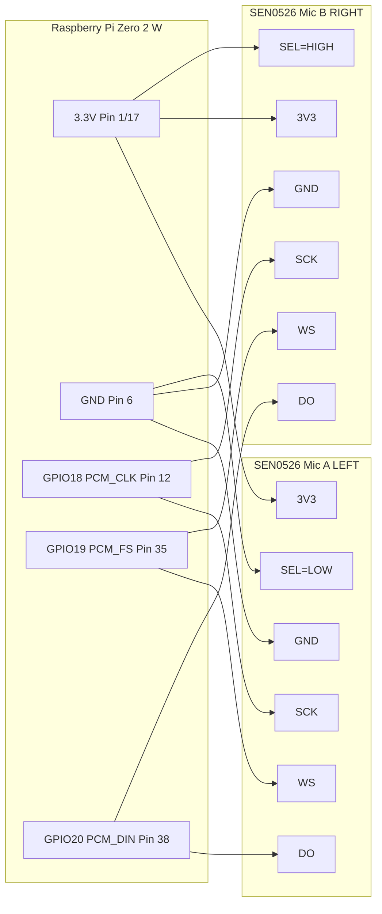

# Raspberry Pi Zero 2 W + 2× DFRobot SEN0526 (I2S MEMS) Stereo Capture
# Raspberry Pi Zero 2 W + 2× DFRobot SEN0526 (I2S MEMS) 立體聲錄音

> **English**: A complete guide for wiring **two** DFRobot **SEN0526** I2S MEMS microphones to a **Raspberry Pi Zero 2 W** and recording **stereo (L/R)** audio using ALSA.
>
> **中文**: 完整教學說明如何將 **兩顆** DFRobot **SEN0526** I2S MEMS 麥克風接到 **Raspberry Pi Zero 2 W** 並使用 ALSA 錄製 **立體聲（L/R）** 音訊。

**Tested with / 測試環境**: `dtoverlay=googlevoicehat-soundcard` (48 kHz)

---

## Table of Contents / 目錄

- [Hardware / 硬體](#hardware--硬體)
- [I2S Concept / I2S 觀念](#i2s-concept--i2s-觀念)
- [Wiring / 接線](#wiring--接線)
- [Software Setup / 軟體設定](#software-setup--軟體設定)
- [Recording / 錄音](#recording--錄音)
- [systemd Auto-start / 開機自動錄音](#systemd-auto-start--開機自動錄音)
- [Troubleshooting / 疑難排解](#troubleshooting--疑難排解)
- [References / 參考資料](#references--參考資料)

---

## Hardware / 硬體

### Bill of Materials / 材料清單
- **Raspberry Pi Zero 2 W** (40-pin header / 40針腳位)
  - Also compatible with / 也相容於: Zero W, Pi 3, Pi 4
- **2 × DFRobot SEN0526** (Fermion: I2S MEMS Microphone)
  - Chip: MSM261D4030H0
- **(Recommended / 建議)** 1 × **100 kΩ resistor** (DO bus pull-down to GND / DO 匯流排下拉至 GND)
- **(Recommended / 建議)** 2 × **0.1 µF capacitors** (decoupling near each mic board / 每個麥克風板附近的去耦電容)
- **Jumper wires** or breadboard / 杜邦線或麵包板
  - Keep I2S lines short (< 10 cm) / 保持 I2S 線路短 (< 10 cm)

---

## I2S Concept / I2S 觀念

### Why share one DO bus? / 為什麼共用一條 DO 匯流排？

**English:**
- Both microphones share the same `SCK (BCLK)` and `WS (LRCLK)` lines.
- Both microphones' `DO (SD)` outputs can be **connected together** to Pi's `PCM_DIN (GPIO20)`.
- When it's not the microphone's channel, it puts `DO` in **tri-state** (high impedance).
- The `SEL` pin determines whether it outputs on the Left or Right time slot.

**中文：**
- 兩顆麥克風共用 **同一組** `SCK(BCLK)` 與 `WS(LRCLK)`。
- 兩顆麥克風的 `DO(SD)` **可以併在一起** 接到 Raspberry Pi 的 `PCM_DIN(GPIO20)`。
- 麥克風在「不是自己那個聲道」時會讓 `DO` 進入 **tri-state**（高阻態）。
- `SEL` 腳位決定它輸出在 Left 或 Right 時間槽。

---

## Wiring / 接線

---

## Wiring / 接線

### SEN0526 Pin Description / SEN0526 腳位說明

Module label / 模組標示: `GND 3V3 WS SEL SCK DO`

| Pin | Function | Description |
|---|---|---|
| **SCK** | I2S BCLK | Bit clock / 位元時脈 |
| **WS** | I2S LRCLK | Left/Right clock / 左右聲道時脈 |
| **DO** | I2S SD | Data output / 資料輸出 |
| **SEL** | Channel Select | Left (GND) or Right (3V3) / 左聲道（GND）或右聲道（3V3） |
| **3V3** | Power | 3.3V power supply / 3.3V 電源 |
| **GND** | Ground | Ground / 接地 |

### Raspberry Pi I2S/PCM Pins / Raspberry Pi I2S/PCM 腳位

| BCM GPIO | Physical Pin | Function | Description |
|---|---|---|---|
| **GPIO18** | **12** | PCM_CLK | I2S BCLK / 位元時脈 |
| **GPIO19** | **35** | PCM_FS | I2S LRCLK / 左右時脈 |
| **GPIO20** | **38** | **PCM_DIN** | **Data input (for mic) / 資料輸入（麥克風用）** |
| GPIO21 | 40 | PCM_DOUT | Data output (not used) / 資料輸出（不使用） |
| — | **1 or 17** | 3.3V | Power supply / 電源供應 |
| — | **6 or any GND** | GND | Ground / 接地 |

### Pin Map (Stereo: one mic = Left, the other = Right)
### 腳位對應（立體聲：一個麥克風 = 左聲道，另一個 = 右聲道）

⚠️ **All Raspberry Pi GPIO pins are 3.3V logic. Do not feed 5V logic into GPIO.**  
⚠️ **所有 Raspberry Pi GPIO 腳位都是 3.3V 邏輯。請勿將 5V 邏輯接入 GPIO。**

| Signal | Raspberry Pi (BCM) | Pi physical pin | Mic A (Left) | Mic B (Right) |
|---|---:|---:|---|---|
| **3V3** | — | **1** (or 17) | 3V3 | 3V3 |
| **GND** | — | **6** (or any GND) | GND | GND |
| **BCLK** | **GPIO18** (PCM_CLK) | **12** | SCK | SCK |
| **LRCLK** | **GPIO19** (PCM_FS) | **35** | WS | WS |
| **DATA IN** | **GPIO20** (PCM_DIN) | **38** | DO | DO |
| **Channel select** | — | — | **SEL → GND** | **SEL → 3V3** |

**Important Notes / 重要提醒：**
- ✅ Use `PCM_DIN (GPIO20)` for microphone input / 麥克風輸入使用 `PCM_DIN (GPIO20)`
- ❌ Do NOT use `PCM_DOUT (GPIO21)` / 請勿使用 `PCM_DOUT (GPIO21)`
- 🔌 Both microphones' `DO` connect to the same GPIO20 / 兩顆麥克風的 `DO` 都接到同一個 GPIO20

**DO pull-down (recommended) / DO 下拉（建議）:**  
Place **100 kΩ** resistor from the shared **DO bus** to **GND** to prevent floating when tri-state.  
在共用的 **DO 匯流排**與 **GND** 之間放置 **100 kΩ** 電阻以避免 tri-state 時浮動。

**Decoupling capacitors (optional) / 去耦電容（選配）:**  
Add **0.1 µF** ceramic capacitor between 3V3 and GND near each microphone to filter power noise.  
在每個麥克風的 3V3 和 GND 之間加 **0.1 µF** 陶瓷電容以濾除電源雜訊。

### Wiring Checklist / 接線檢查清單

Before powering on / 開機前檢查:
- [ ] 3V3 and GND connections are correct (check polarity) / 3V3 和 GND 接線正確（檢查極性）
- [ ] SCK, WS, DO connected to correct GPIOs / SCK、WS、DO 接到正確的 GPIO
- [ ] Left mic SEL → GND, Right mic SEL → 3V3 / 左麥克風 SEL → GND，右麥克風 SEL → 3V3
- [ ] DO bus has 100 kΩ pull-down to GND / DO 匯流排有 100 kΩ 下拉至 GND
- [ ] All connections are secure / 所有連接牢固
- [ ] No short circuits between 3V3 and GND / 3V3 和 GND 之間無短路

### Breadboard vs Soldering / 麵包板 vs 焊接

**Testing phase / 測試階段:**
- Use breadboard and jumper wires for easy adjustment / 使用麵包板和杜邦線方便調整
- Keep I2S signal wires short (< 10 cm) / 保持 I2S 訊號線短（< 10 cm）

**Permanent installation / 正式安裝:**
- Solder to perfboard or custom PCB / 焊接到洞洞板或自製 PCB
- Reduces contact issues and noise / 減少接觸不良和雜訊
- Use proper strain relief for wires / 對線材使用適當的應力消除

### Wiring diagram / 接線圖 (Mermaid)




---

## Software Setup (Raspberry Pi OS)
## 軟體設定（Raspberry Pi OS）

### 0) Install OS / 安裝作業系統

**Using Raspberry Pi Imager / 使用 Raspberry Pi Imager:**

1. Download and install [Raspberry Pi Imager](https://www.raspberrypi.com/software/)
2. Select **Raspberry Pi OS Lite** (64-bit recommended for Zero 2 W)
3. Click the gear icon ⚙️ for advanced settings / 點擊齒輪圖示⚙️進行進階設定

**Configure settings / 設定選項:**
- ✅ **Enable SSH** / 啟用 SSH
  - Use password authentication / 使用密碼驗證
- ✅ **Set username and password** / 設定使用者名稱和密碼
  - Username: `pi` (or your choice / 或自選)
  - Password: (choose a secure password / 選擇安全密碼)
- ✅ **Configure Wi-Fi** (for Zero 2 W) / 設定 Wi-Fi（用於 Zero 2 W）
  - SSID: your network name / 您的網路名稱
  - Password: your Wi-Fi password / 您的 Wi-Fi 密碼
  - Country: select your country / 選擇您的國家
- ✅ **Set locale settings** / 設定語系
  - Timezone: your timezone / 您的時區
  - Keyboard layout: your layout / 您的鍵盤配置

4. Write to SD card / 寫入 SD 卡
5. Insert SD card into Pi and power on / 將 SD 卡插入 Pi 並開機

**First login / 首次登入:**
```bash
# Wait ~30-60 seconds for boot, then connect via SSH
# 等待約 30-60 秒開機，然後透過 SSH 連線
ssh pi@raspberrypi.local
# or use IP address / 或使用 IP 位址
ssh pi@<your-pi-ip>
```

### 1) Update system & install packages / 更新系統並安裝套件

```bash
# Update package lists / 更新套件列表
sudo apt update

# Upgrade all packages / 升級所有套件
sudo apt full-upgrade -y

# Install required packages / 安裝必要套件
sudo apt install -y alsa-utils sox git python3
```

**Package descriptions / 套件說明:**
- `alsa-utils` - ALSA audio tools (includes `arecord`) / ALSA 音訊工具（包含 `arecord`）
- `sox` - Audio processing tool (for splitting stereo) / 音訊處理工具（用於分離立體聲）
- `git` - Version control (for cloning this repo) / 版本控制（用於下載本專案）
- `python3` - Python 3 (for level checking script) / Python 3（用於音量檢查腳本）

### 2) Edit config.txt / 編輯 config.txt

**Find config.txt location / 找到 config.txt 位置：**

```bash
# Check which file exists / 檢查哪個檔案存在
ls -l /boot/config.txt /boot/firmware/config.txt 2>/dev/null
```

**Location depends on OS version / 位置取決於作業系統版本:**
- **Bookworm (new / 新版)**: `/boot/firmware/config.txt`
- **Bullseye and earlier / Bullseye 及更早**: `/boot/config.txt`

**Edit the file / 編輯檔案：**

For Bookworm / 適用於 Bookworm:
```bash
sudo nano /boot/firmware/config.txt
```

For Bullseye or earlier / 適用於 Bullseye 或更早:
```bash
sudo nano /boot/config.txt
```

**Add these lines at the end / 在檔案末尾加入：**

```ini
# ===== I2S MEMS Microphone Configuration =====
# Disable onboard audio (conflicts with I2S)
# 停用板載音訊（與 I2S 衝突）
dtparam=audio=off

# Enable I2S interface
# 啟用 I2S 介面
dtparam=i2s=on

# Load Google Voice HAT sound card driver
# 載入 Google Voice HAT 音效卡驅動
# This provides 48kHz stereo capture
# 提供 48kHz 立體聲錄音
dtoverlay=googlevoicehat-soundcard
```

**Save and exit / 儲存並退出:**
- Press `Ctrl+O` then `Enter` to save / 按 `Ctrl+O` 然後 `Enter` 儲存
- Press `Ctrl+X` to exit / 按 `Ctrl+X` 退出

**Why googlevoicehat-soundcard? / 為什麼選擇 googlevoicehat-soundcard？**
- ✅ Built-in to Raspberry Pi OS (no compilation needed) / Raspberry Pi OS 內建（無需編譯）
- ✅ Stable and well-tested / 穩定且經過充分測試
- ✅ Automatic 48kHz / 16-bit stereo configuration / 自動設定 48kHz / 16 位元立體聲
- ✅ Suitable for most I2S MEMS microphones / 適用於大多數 I2S MEMS 麥克風
- ⚠️ Fixed at 48kHz (cannot change sample rate) / 固定在 48kHz（無法更改採樣率）

### 3) Reboot / 重新啟動

```bash
sudo reboot
```

Wait ~30 seconds, then reconnect via SSH.  
等待約 30 秒，然後重新透過 SSH 連線。

### 4) Confirm ALSA device / 確認 ALSA 設備

**Check sound cards / 檢查音效卡：**
```bash
cat /proc/asound/cards
```

**Expected output / 預期輸出:**
```
 0 [vc4hdmi       ]: vc4-hdmi - vc4-hdmi
                      vc4-hdmi
 1 [googlevoicehat]: googlevoicehat-soundcar - googlevoicehat-soundcar
                      googlevoicehat-soundcard
```

**List capture devices / 列出錄音裝置：**
```bash
arecord -l
```

**Expected output / 預期輸出:**
```
**** List of CAPTURE Hardware Devices ****
card 1: googlevoicehat [googlevoicehat-soundcard], device 0: Google voiceHAT SoundCard HiFi voicehat-hifi-0 [...]
  Subdevices: 1/1
  Subdevice #0: subdevice #0
```

Note the `card` number (usually **1**) and `device` number (usually **0**).  
記下 `card` 編號（通常是 **1**）和 `device` 編號（通常是 **0**）。

**Check supported parameters / 檢查支援的參數：**
```bash
arecord -D hw:1,0 --dump-hw-params -d 1 /dev/null
```

This shows supported sample rates, formats, and channels.  
這會顯示支援的採樣率、格式和聲道數。

---

## Recording / 錄音

### Method 1: Quick record using scripts / 方法 1：使用腳本快速錄音

**Clone this repository / 下載本專案：**
```bash
cd ~
git clone https://github.com/cychiang-ntpu/audio-streaming-from-laptop-to-iphone.git
cd audio-streaming-from-laptop-to-iphone
chmod +x scripts/*.sh
```

**Check environment / 檢查環境：**
```bash
./scripts/check_env.sh
```

**Record 5 seconds of stereo audio / 錄製 5 秒立體聲：**
```bash
CARD=1 DEV=0 ./scripts/record_stereo.sh 5
```

Output goes to `recordings/` directory with timestamp.  
輸出到 `recordings/` 目錄，檔名含時間戳記。

**Check channel levels / 檢查聲道音量：**
```bash
python3 ./scripts/check_levels.py recordings/stereo_*.wav
```

### Method 2: Manual recording / 方法 2：手動錄音

**Record 5 seconds / 錄製 5 秒：**
```bash
arecord -D hw:1,0 -c 2 -r 48000 -f S32_LE -d 5 test_stereo.wav
```

**Parameters explained / 參數說明：**
- `-D hw:1,0`: Device (card 1, device 0) / 設備（卡 1，設備 0）
- `-c 2`: Stereo (2 channels) / 立體聲（2 聲道）
- `-r 48000`: Sample rate 48kHz / 採樣率 48kHz
- `-f S32_LE`: 32-bit PCM (for I2S MEMS) / 32 位元 PCM（用於 I2S MEMS）
- `-d 5`: Duration 5 seconds / 時長 5 秒

**Split into left and right channels / 分離左右聲道：**
```bash
sox test_stereo.wav left.wav remix 1
sox test_stereo.wav right.wav remix 2
```

### Sanity test / 健全性測試

Record yourself speaking **near Left mic only**, then **near Right mic only**.  
先只對著**左麥克風**說話錄音，再只對著**右麥克風**說話錄音。

Run the level check / 執行音量檢查:
```bash
python3 ./scripts/check_levels.py test_stereo.wav
```

You should see Left > Right when speaking near left mic, and vice versa.  
對著左麥克風說話時應該看到 Left > Right，反之亦然。

---

## systemd Auto-start / 開機自動錄音

If you want recording to start automatically at boot / 如果想要開機時自動開始錄音:

**1) Copy service file / 複製服務檔案：**
```bash
sudo cp systemd/stereo-mic-capture.service /etc/systemd/system/
```

**2) Edit the service file to match your setup / 編輯服務檔案以符合您的設定：**
```bash
sudo nano /etc/systemd/system/stereo-mic-capture.service
```

Update `WorkingDirectory` to your repo location.  
更新 `WorkingDirectory` 為您的專案位置。

**3) Enable and start the service / 啟用並啟動服務：**
```bash
sudo systemctl enable stereo-mic-capture.service
sudo systemctl start stereo-mic-capture.service
```

**4) Check status / 檢查狀態：**
```bash
sudo systemctl status stereo-mic-capture.service
```

**5) View logs / 查看記錄：**
```bash
sudo journalctl -u stereo-mic-capture.service -f
```

---

## Troubleshooting / 疑難排解

### Problem: No sound card detected / 問題：偵測不到音效卡

**Check I2S is enabled / 檢查 I2S 是否啟用：**
```bash
sudo raspi-config
# Select: Interface Options > I2S > Enable
```

**Verify config.txt / 驗證 config.txt：**
```bash
cat /boot/firmware/config.txt | grep -E "i2s|googlevoicehat"
```

### Problem: Recording is silent or noisy / 問題：錄音無聲或有雜訊

**Check wiring / 檢查接線：**
- ✅ DO pins connected to GPIO20 (not GPIO21) / DO 腳位接到 GPIO20（不是 GPIO21）
- ✅ SEL: one mic to GND, other to 3V3 / SEL：一個麥克風接 GND，另一個接 3V3
- ✅ 100 kΩ pull-down resistor on DO bus / DO 匯流排上有 100 kΩ 下拉電阻
- ✅ All connections are secure / 所有連接牢固

**Test hardware / 測試硬體：**
```bash
arecord -D hw:1,0 --dump-hw-params -d 1 /dev/null
```

### Problem: Sample rate error / 問題：採樣率錯誤

`googlevoicehat-soundcard` is **fixed at 48kHz**. Cannot be changed.  
`googlevoicehat-soundcard` **固定在 48kHz**。無法更改。

If you need other sample rates, use different overlays like `hifiberry-dac`.  
如果需要其他採樣率，請使用其他驅動如 `hifiberry-dac`。

### Problem: Wrong channel assignment / 問題：聲道分配錯誤

If left and right are swapped / 如果左右聲道相反:
- Swap the SEL connections on the two microphones / 交換兩個麥克風的 SEL 連接
- Or swap them in post-processing with sox / 或用 sox 在後製時交換

---

## Notes / 注意事項

**About I2S MEMS microphones / 關於 I2S MEMS 麥克風：**
- Many I2S MEMS mics output **24-bit samples in 32-bit words**.  
  許多 I2S MEMS 麥克風以 **32 位元字組輸出 24 位元樣本**。
- This repo uses `S32_LE` format for robustness.  
  本專案使用 `S32_LE` 格式以確保穩定性。
- Actual dynamic range is ~94 dB (24-bit).  
  實際動態範圍約 94 dB（24 位元）。

**Best practices / 最佳實踐：**
- 🔌 Keep I2S wires **short** (< 10 cm) / 保持 I2S 線路**短** (< 10 cm)
- ⚡ Use a **solid ground** connection / 使用**可靠的接地**連接
- 🔋 Add **0.1 µF decoupling capacitors** near each mic / 在每個麥克風附近添加 **0.1 µF 去耦電容**
- 📍 For permanent installation, **solder** connections instead of breadboard / 正式安裝時，**焊接**連接而非使用麵包板

---

## References / 參考資料

### External Documentation / 外部文件
- [Adafruit I2S MEMS Microphone Breakout - Overview](https://learn.adafruit.com/adafruit-i2s-mems-microphone-breakout/overview)
- [Setting up I2S Soundcard on Raspberry Pi (INMP441 Microphone)](https://protonestiot.medium.com/setting-up-i2s-soundcard-on-raspberry-pi-inmp441-microphone-f0c8fc859b2e)
- [DFRobot SEN0526 Product Page](https://www.dfrobot.com/product-2357.html)
- [Raspberry Pi I2S Documentation](https://www.raspberrypi.com/documentation/computers/raspberry-pi.html#i2s)

### Scripts / 腳本
- [check_env.sh](scripts/check_env.sh) - Environment checker / 環境檢查器
- [record_stereo.sh](scripts/record_stereo.sh) - Stereo recording script / 立體聲錄音腳本
- [check_levels.py](scripts/check_levels.py) - Channel level analyzer / 聲道音量分析器
- [systemd service](systemd/stereo-mic-capture.service) - Auto-start service / 開機自動啟動服務

---

## License / 授權

MIT License - Feel free to use and modify.  
MIT 授權 - 歡迎使用和修改。

---

## Contributing / 貢獻

Issues and pull requests are welcome!  
歡迎提交問題和拉取請求！

GitHub: [cychiang-ntpu/audio-streaming-from-laptop-to-iphone](https://github.com/cychiang-ntpu/audio-streaming-from-laptop-to-iphone)

